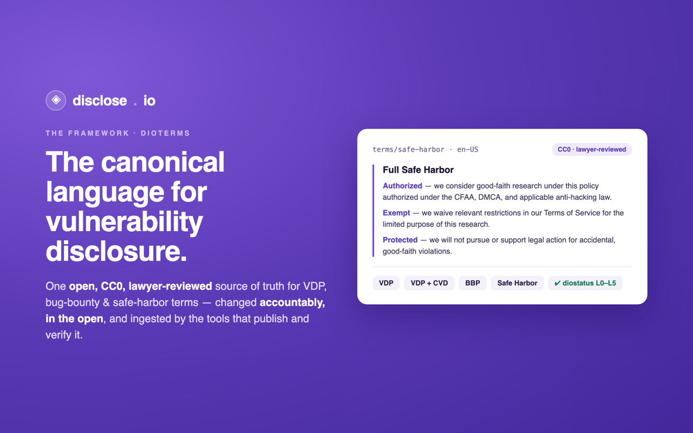
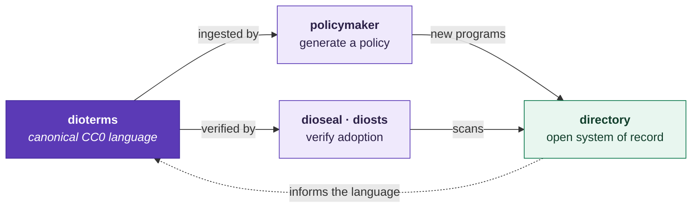

# dioterms — the disclose.io Framework

### The canonical, public-domain language for vulnerability disclosure — and an open, accountable way to change it.

*Part of **[the disclose.io Project](https://disclose.io)** — the open, vendor-neutral infrastructure for vulnerability disclosure. [Browse the ecosystem →](https://github.com/disclose)*

---

> **Two jobs:** be the *canonical reference language* for vulnerability disclosure, and be an *open-source, accountable way to update and modify it*. See **[MISSION.md](./MISSION.md)** for the mission & vision.

> Everything here is [CC0 1.0](./LICENSE) — public domain. Fork it, adopt it, adapt it, ship it. *(While we've engaged the legal opinion of many, this does not constitute legal advice — please consult your own counsel for suitability in your organisation.)*

## How it fits together

One source, many consumers, no drift — that single-source-of-truth architecture is the point.

Change the language here, and it flows — accountably, via reviewed PRs — into every tool that publishes or verifies it.

## The four canonical term templates

These four live under [`terms/`](./terms/) and mirror [policymaker.disclose.io](https://policymaker.disclose.io) 1:1. They are what people modify, comment on, and PR — the source of truth for the live renders policymaker produces.

| Template | When to use | Path |
|----------|-------------|------|
| **[VDP](./terms/vdp/)** | Vulnerability disclosure policy without a specified coordinated-disclosure window | [`terms/vdp/`](./terms/vdp/) |
| **[VDP with CVD](./terms/vdp-with-cvd/)** | Same, with a stated coordinated-disclosure window (`{{disclosure_window}} days`) | [`terms/vdp-with-cvd/`](./terms/vdp-with-cvd/) |
| **[Safe Harbor](./terms/safe-harbor/)** | Standalone full safe-harbor clause — attach to an existing policy | [`terms/safe-harbor/`](./terms/safe-harbor/) |
| **[Simple Safe Harbor](./terms/simple-safe-harbor/)** | Condensed safe-harbor clause for quick adoption | [`terms/simple-safe-harbor/`](./terms/simple-safe-harbor/) |

Each is provided in `en-US`, `ar`, and `ne-NP` (see [`terms/languages.json`](./terms/languages.json)). Translations are welcomed via PR — see [`terms/README.md`](./terms/README.md).

## Other content

| Directory | Purpose |
|-----------|---------|
| [`terms/bbp/`](./terms/bbp/) | **Bug Bounty Program policy template** — a superset of the VDP with rewards and scope language. Lives under `terms/` as a fifth canonical (not carried by policymaker). English-only until translations are contributed. |
| [`regional/`](./regional/) | **Regional variants** contributed by PSIRTs, disclosure platforms, policy advocates, and vendor program operators. Adapts safe-harbor language to local legal and regulatory context (USA, CAN, BEL, NLD, CHE; AUS, GBR, NZL marked draft in their file headers). |
| [`maturity/`](./maturity/) | **diostatus** — the 6-level program maturity model. Findable → Communicating → Not hostile → Explicitly safe → Accountable. |
| [`practices/`](./practices/) | **Operational practices** — conduct guidance for good-faith research. Currently: [accepted practices for good-faith security research](./practices/good-faith-security-research.md). |
| [`archive/`](./archive/) | Deprecated or historical content preserved for reference. Includes the old modular-fragments folder (`core-terms/`), the 2020 US-elections variant, and the pre-split generic terms. |

## Provenance

**Where these terms came from:** [history.disclose.io](https://history.disclose.io) is the sourced provenance record for the dioterms — it traces the language back to its earliest internet-verifiable ancestor (a 2014 Bugcrowd repository, roughly four years before the disclose.io brand) with every claim anchored to a live archive.

Every term file carries a `<!-- Provenance — … -->` header naming its source and license — **[CC0 1.0](./LICENSE)** by default; externally-authored documents keep their own attribution (see [`practices/good-faith-security-research.md`](./practices/good-faith-security-research.md)). Deeper authorship and change history live in `git log --follow` on each file, so files are always moved with `git mv` — never delete-and-recreate — to keep blame intact. [`archive/`](./archive/) preserves deprecated terms as-is. See [CONTRIBUTING.md](./CONTRIBUTING.md) for the rules.

## Quick Links

| | |
|-|-|
| Generate a personalised policy | [policymaker.disclose.io](https://policymaker.disclose.io) |
| Canonical reference site | [disclose.io/framework/](https://disclose.io/framework/) |
| Where the terms came from | [history.disclose.io](https://history.disclose.io) |
| Community forum | [community.disclose.io](https://community.disclose.io) |
| Compare real-world programs | [disclose.io/programs](https://disclose.io/programs) |

## About Safe Harbor

The core requirements for **Full Safe Harbor** are for the policy to provide:

- Authorisation against anti-hacking laws (CFAA, CMA, equivalent)
- Exemption from anti-circumvention laws (DMCA, equivalent)
- Exemption from violation of the organisation's own TOS/AUP during security testing
- A statement acknowledging good-faith research

The intent is for this language to be followed specifically, with minor modifications if any. If you modify, preserve the four tenets above.

Policies missing any of the core tenets but containing a good-faith non-pursuit commitment meet the criteria for **Partial Safe Harbor**.

> Incentives or "bounties" for vulnerability reports are not a prerequisite for Safe Harbor or for a program to be considered a VDP.

## Disclosure types

- **Coordinated Disclosure** — researcher may share details after a fix has been applied and the program owner has granted permission, or after a clearly-stated time has passed from submission, whichever is sooner.
- **Discretionary Disclosure** — researcher or program owner may request mutual permission to share details after explicit approval.
- **Non-Disclosure** — researchers are required to keep details and the existence of the program confidential. Generally inappropriate for VDPs.

## Additional policy sections (templated)

- **Scope** (required) — explicit "in-scope" assets. Err on the side of inclusiveness.
- **Out-of-Scope** (optional) — systems or activities the organisation discourages testing against.
- **Rewards** (optional, BBPs only) — payment policy and parameters.
- **Official Communication Channels** (required) — complete list of intake methods.
- **Disclosure Policy** (required) — conditions under which researchers may disclose to third parties.

## Contributing

See **[CONTRIBUTING.md](./CONTRIBUTING.md)** for the full guide — provenance rules, the RFC flow for term-wording changes, and how renames must be coordinated with downstream consumers. In brief:

- **Core term language** — policymaker treats these four templates as authoritative for its live render; edits to [`terms/`](./terms/) flow into policymaker via its next release. Substantive changes: open a GitHub Discussion first, then a PR.
- **BBP template** — PR against [`terms/bbp/`](./terms/bbp/).
- **Regional variants** — fork → add `regional/<ISO3>-core-terms.md` → PR.
- **Maturity model** — PR against [`maturity/*.md`](./maturity/).
- **Translations** — add locale files (`ar.md`, `ne-NP.md`, etc.) alongside `en-US.md` in any [`terms/*/`](./terms/) folder and update [`terms/languages.json`](./terms/languages.json).

`CODEOWNERS` routes reviews to the appropriate team.

## Once you've published your policy

- Add the [disclose.io seal](https://github.com/disclose/dioseal) to your public program brief
- Submit a PR to add your program to [diodb](https://github.com/disclose/diodb)
- Let the world know you've joined the initiative
- Contribute back to the framework you just adopted
